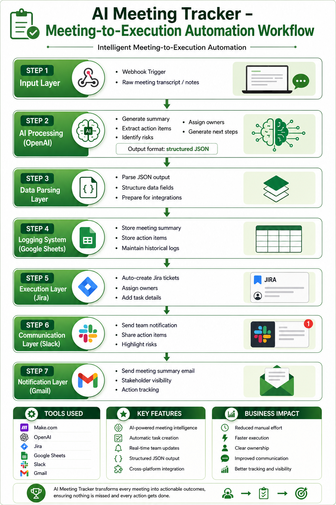
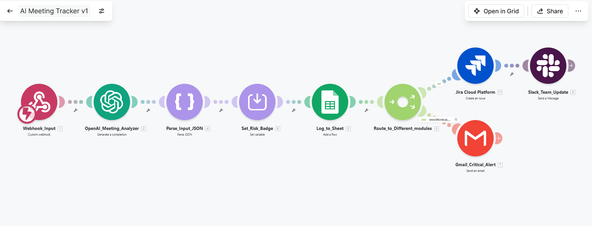
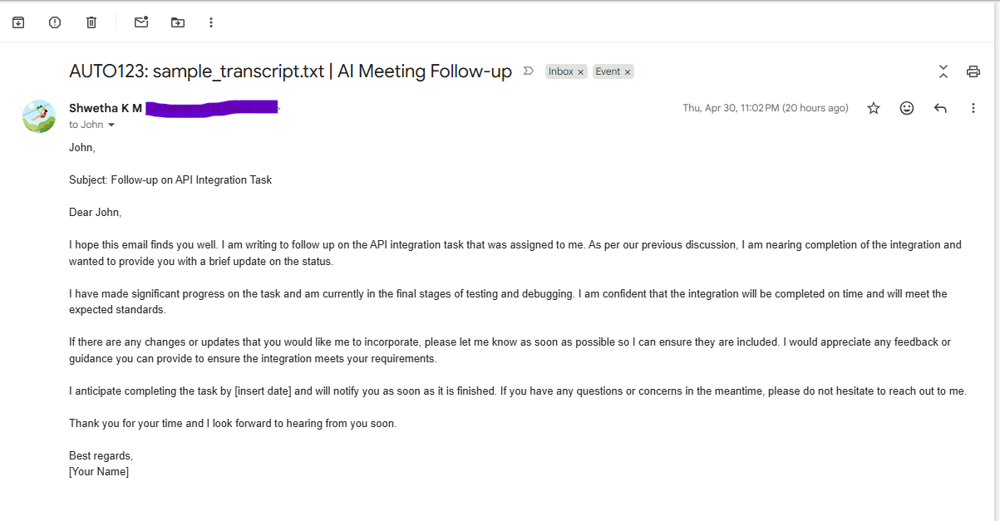
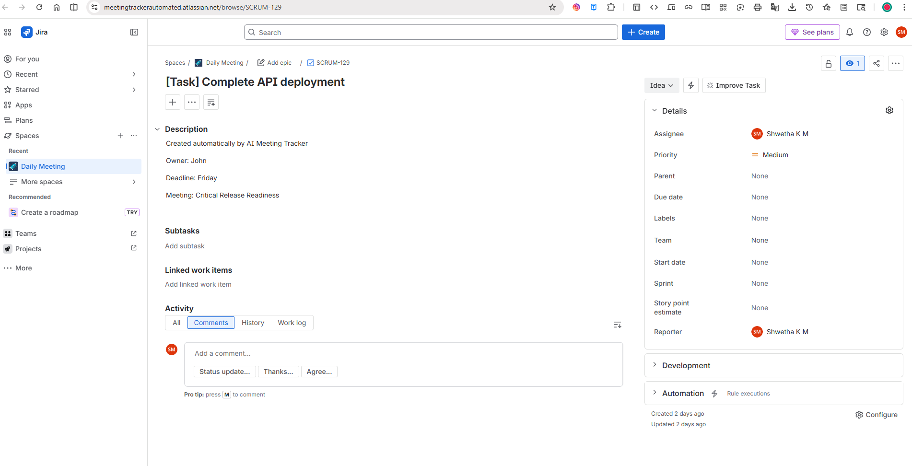
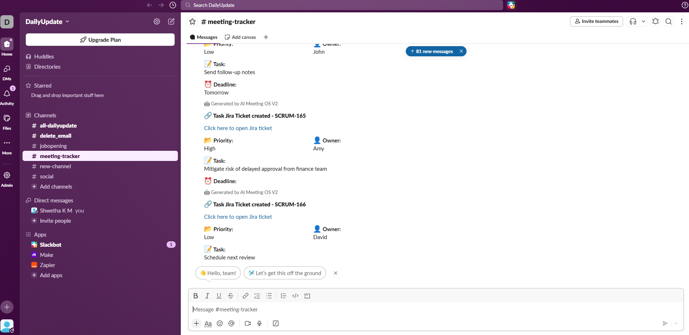

# AI Meeting Tracker – Intelligent Meeting-to-Execution Automation

## 🚀 Project Overview

AI Meeting Tracker is a real-world business automation solution built using Make.com, OpenAI, Jira, Google Sheets, Slack, and Gmail.

It transforms raw meeting notes into structured business actions automatically.

Instead of teams manually writing notes, forgetting action items, and missing follow-ups, this system converts meetings into:

- AI summaries  
- Action items  
- Jira tickets  
- Slack notifications  
- Email alerts  
- Historical logs

---

## 🎯 Problem Statement

Teams spend significant time in:

- Daily standups  
- Sprint retrospectives  
- Planning meetings  
- Stakeholder syncs  

But after meetings:

- Notes are messy  
- Actions are missed  
- Ownership unclear  
- Follow-ups delayed  
- Risks not escalated

This causes delivery inefficiency and communication gaps.

---

## 💡 Solution

AI Meeting Tracker automates the full meeting follow-up lifecycle.---

## 💡 Infographic Overview



### Input

Raw transcript / meeting notes

### AI Processing

- Summary generation  
- Action extraction  
- Risk detection  
- Owner identification  
- Next steps generation



### Automated Outputs

- Create Jira issue  
- Notify Slack team channel  
- Send Gmail summary  
- Store records in Google Sheets





---

## 🏗 Architecture

```text
Webhook Trigger
   ↓
OpenAI Analysis
   ↓
Parse JSON
   ↓
Google Sheets Logging
   ↓
Jira Issue Creation
   ↓
Slack Notification
   ↓
Gmail Alert
```

---

## 🔧 Tech Stack

| Tool | Purpose |
|---|---|
| Make.com | Workflow orchestration |
| OpenAI | Meeting intelligence |
| Jira | Task execution |
| Google Sheets | Logging / reporting |
| Slack | Team communication |
| Gmail | Stakeholder alerts |

---

## 🔥 Key Features

### 1. AI Meeting Intelligence

Transforms unstructured notes into JSON:

```json
{
  "summary":"",
  "action_items":"",
  "risks":"",
  "owners":"",
  "next_steps":""
}
```

### 2. Jira Auto Ticketing

Creates execution tickets like:

```text
SCRUM-1
Resolve blocker in testing
```

### 3. Slack Alerts

Real-time team updates.

### 4. Email Summaries

Leadership-ready status emails.

### 5. Historical Data Logging

All meetings saved for analytics.

---

## 📈 Business Impact

- Reduced manual meeting admin work  
- Faster action creation  
- Better ownership tracking  
- Faster risk escalation  
- Improved visibility for managers

---

## 🧠 Challenges Solved

- Jira authentication and API setup  
- Mandatory assignee/reporter validation  
- AI output converted from text to JSON  
- Multi-system integration across six tools

---

## 💼 Why This Project Matters

This project demonstrates:

- AI automation design  
- Workflow architecture  
- Real business use case  
- Agile + Jira ecosystem knowledge  
- Cross-platform integration  
- Debugging and problem solving

---

## 📷 Suggested Screenshots

1. Full Make.com workflow  
2. Jira ticket auto-created  
3. Slack notification card  
4. Google Sheet logs  
5. Gmail summary email

---

## 📂 Folder Structure

```text
AI-Meeting-Tracker/
│── make-blueprints/
│── screenshots/
│── prompts/
│── docs/
│── README.md
```

